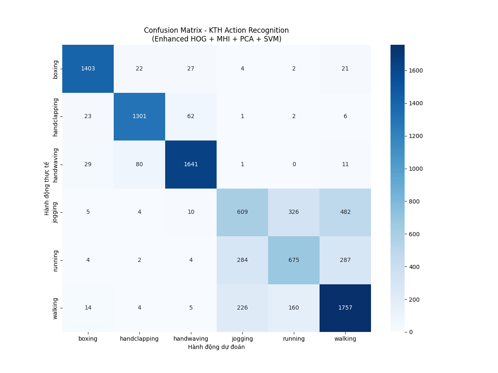

# Project_CK_HumanAction
# 🏃 Human Action Recognition

Ứng dụng nhận diện hành động người theo thời gian thực sử dụng **HOG + MHI + SVM**, được xây dựng bằng **Streamlit**. Hỗ trợ cả upload video lẫn webcam trực tiếp.

---

## 📌 Tổng quan

Dự án sử dụng tập dữ liệu **KTH Action Dataset** để huấn luyện mô hình phân loại 6 hành động cơ bản của con người:

| Nhãn | Hành động |
|------|-----------|
| 🥊 Boxing | Đấm bốc |
| 👏 Handclapping | Vỗ tay |
| 👋 Handwaving | Vẫy tay |
| 🏃 Jogging | Chạy bộ nhẹ |
| 🏅 Running | Chạy nhanh |
| 🚶 Walking | Đi bộ |

---

## ⚙️ Kiến trúc hệ thống

```
Input (Video / Webcam)
        ↓
  Lấy 12 frames liên tiếp
        ↓
  Trích xuất đặc trưng
  ├── HOG (frame đầu)
  ├── HOG (frame giữa)
  ├── HOG (frame cuối)
  └── HOG từ MHI (Motion History Image)
        ↓
  Vector 7056 chiều
        ↓
  Scaler → PCA → SVM
        ↓
  Nhãn hành động + Độ tin cậy (%)
```

**Ngưỡng dự đoán:** Chỉ hiển thị kết quả khi confidence > 35%.

---

## 🗂️ Cấu trúc thư mục

```
Project_CK_HumanAction/
├── app.py                    # Ứng dụng Streamlit chính
├── requirements.txt          # Các thư viện cần thiết
├── confusion_matrix_v2.png   # Ma trận nhầm lẫn của mô hình
├── models/
│   ├── scaler.pkl            # StandardScaler đã fit
│   ├── pca.pkl               # PCA đã fit
│   └── svm_kth.pkl           # Mô hình SVM đã huấn luyện
└── src/                      # Mã nguồn huấn luyện
```

---

## 🚀 Cài đặt & Chạy

### 1. Clone repository

```bash
git clone https://github.com/dotakk08/Project_CK_HumanAction.git
cd Project_CK_HumanAction
```

### 2. Cài đặt thư viện

```bash
pip install -r requirements.txt
```

### 3. Chạy ứng dụng

```bash
streamlit run app.py
```

Truy cập tại: `http://localhost:8501`

---

## 🖥️ Hướng dẫn sử dụng

### Tab 1 — 📁 Tải Video File
1. Nhấn **Browse files** và chọn file `.mp4` hoặc `.avi`
2. Ứng dụng tự động xử lý từng frame và hiển thị nhãn hành động lên video

### Tab 2 — ⚡ Trực tiếp từ Webcam
1. Nhấn **START** để bật webcam
2. Thực hiện hành động trước camera — kết quả sẽ hiển thị sau khi thu đủ 12 frames
3. Nếu gặp lỗi **"Connection error"**, thử nhấn F5 hoặc dùng **Google Chrome**

> 💡 **Mẹo:** Đứng đủ xa camera (khoảng 1.5–2m) để ứng dụng nhận diện chính xác hơn.

---

## 🧠 Chi tiết kỹ thuật

### Trích xuất đặc trưng

| Đặc trưng | Mô tả |
|-----------|-------|
| **HOG** | Histogram of Oriented Gradients, trích xuất từ 3 frame (đầu, giữa, cuối) |
| **MHI** | Motion History Image, mã hóa thông tin chuyển động tích lũy theo thời gian |

**Tham số HOG:**
- `orientations = 12`
- `pixels_per_cell = (8, 8)`
- `cells_per_block = (2, 2)`
- `block_norm = 'L2-Hys'`

### Pipeline mô hình
- **StandardScaler** → chuẩn hóa vector đặc trưng
- **PCA** → giảm chiều dữ liệu
- **SVM** (với `predict_proba`) → phân loại hành động

---

## 📊 Kết quả mô hình

Confusion matrix của mô hình trên tập kiểm thử:



---

## 📦 Thư viện chính

| Thư viện | Mục đích |
|----------|----------|
| `streamlit` | Giao diện web |
| `streamlit-webrtc` | Xử lý webcam real-time |
| `opencv-python-headless` | Xử lý ảnh/video |
| `scikit-learn` | Mô hình SVM, PCA, Scaler |
| `scikit-image` | Tính HOG |
| `numpy` | Tính toán ma trận |
| `av` | Codec video cho WebRTC |
| `joblib` | Load/save model |

---

## 🌐 Deploy lên Streamlit Cloud

1. Push toàn bộ code lên GitHub (bao gồm thư mục `models/`)
2. Truy cập [streamlit.io/cloud](https://streamlit.io/cloud) và kết nối repo
3. Đặt **Main file path** là `app.py`
4. Nhấn **Deploy**

---

## 📄 License

Dự án phục vụ mục đích học thuật — Đồ án cuối kỳ môn Thị giác Máy tính / Xử lý ảnh.
